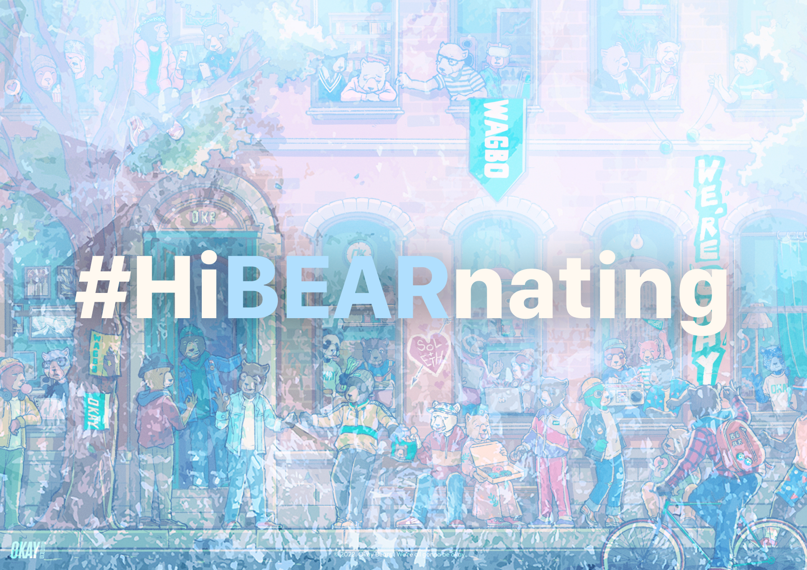

# 🐻 Hi**BEAR**nating
> Make your **NFT** hi**bear**nate.

<div align="center">
  <a href="https://agile-ts.org">
    
  </a>
</div>

---

## 🎇 Getting Started

First, run the development server:

```bash
npm run dev
# or
yarn dev
```

Open [http://localhost:3000](http://localhost:3000) with your browser to see the result.

---

## 👨‍🎓 Learnings

### Deploy `Next.js` App to Vercel
> https://vercel.com/guides/deploying-nextjs-with-vercel

---

## 🔴 Issues

### Error: "LAMBDA_RUNTIME Failed to post handler success response. Http response code: 413."
> https://github.com/vercel/vercel/issues/3825

The maximum payload size for the request body or the response body of a Serverless Function is 5MB.